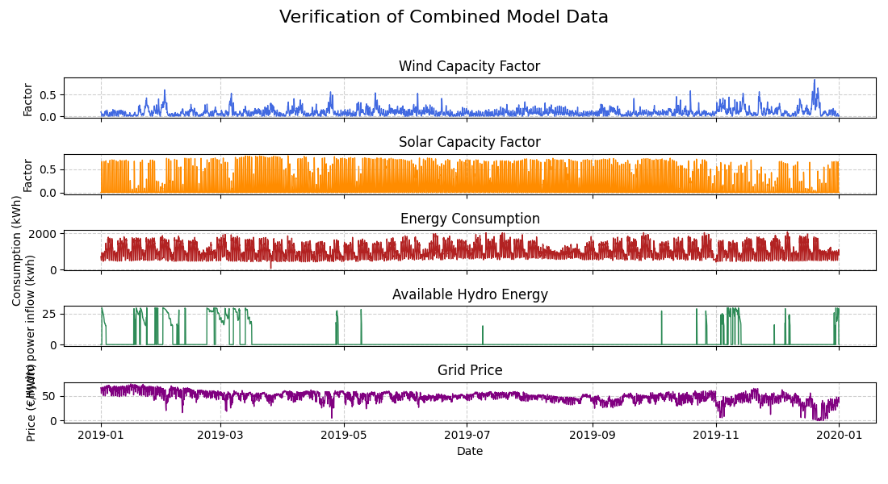

# Energy Community Optimization Model: A Case Study for Castanheira de Pera

This case study on Castanheira de Pera, Portugal, demonstrates the model's capabilities and serves as a guide for users to adapt it to their own contexts.

## Key Features

-   **Technology Mix**: Optimizes a combination of solar, wind, biomass, and hydro power.
    
-   **Storage Integration**: Models both pumped-hydro storage and Vehicle-to-Grid (V2G) from electric cars.
    
-   **Economic Optimization**: Minimizes total annualized costs, including CAPEX, OPEX, and grid electricity purchases.
    
-   **Constraint-Based**: Allows for realistic constraints, such as a total investment budget (`CAPEX_BUDGET`).
    
-   **Highly Adaptable**: The model can be easily reconfigured for a new location by changing the input data files.
    

----------

## The Case Study: Castanheira de Pera

The model was configured using public data for the municipality of Castanheira de Pera, Portugal.

### Input Data

The simulation relies on the following time-series data:

-   **Energy Consumption**: Low-voltage consumption data from the E-REDES open-data portal. The town's total annual demand is ~8,700 MWh for 2,700 inhabitants.
    
-   **Renewable Generation**: Solar and wind profiles were generated with **Renewables.ninja**, using NASA's MERRA-2 meteorological data. Hydro inflow profiles were provided by IST (Instituto Superior Técnico).
    
-   **Market Prices**: Hourly spot prices from the Iberian Electricity Market (MIBEL) were used for grid electricity transactions.
    

> **Note on Adaptability:** This set of data files is the only part of the model that needs to be modified to simulate a new community, making it highly transposable.




----------

## Simulation Scenarios & Results

We ran several scenarios to explore the model's behavior under different conditions.

### Scenario 1: Investment Budget Impact

-   **Goal**: Show how the optimal energy mix changes with the available initial capital. At a given annual demand (200MWh).
    
-   **Simulations**: The model is run with budgets of €180k, €250k, and €348k. To find the optimal budget for a given demand just put 1e9 i the budget (here €348k is the optimal budget).

180k budget:

optimal budget (foudn by model) is 348k:


### Scenario 2: Energy Demand Impact

-   **Goal**: Illustrate how the system's impact differs when targeting a small community vs. the entire town on a fixed budget.
    
-   **Simulations**: The budget is fixed at €250k, while the target annual demand (`ANNUAL_ENERGY_DEMAND`) is changed.
    
-   **Finding**: A modest budget has a limited impact on large-scale demand; an investment's effectiveness is relative to the consumption it targets.
    

### Scenario 3: Utility of Storage Technologies

-   **Goal**: Isolate and quantify the contribution of storage technologies (pumped hydro and V2G) for a fixed budget and demand.
    
-   **Simulations**: Enable/disable pumped hydro (`PUMPING_HYDRO`) and V2G integration in the model.
    
-   **Finding**: Storage is a key enabler for flexibility. It allows the system to store intermittent renewable energy and dispatch it when most valuable, drastically improving profitability.


    

_Pumped hydro stores energy by pumping water (charge, blue) when energy is cheap and releases it by turbining (discharge, red) during peak demand._

_V2G uses EV batteries to absorb energy (charge, blue) and feed it back to the grid (discharge, red) as needed._

### Scenario 4: Production Source Comparison

-   **Goal**: Directly compare the economic performance of different generation technologies.
    
-   **Simulations**: The model is configured to only allow certain technologies (e.g., "Hydro only" vs. "Solar and Wind only"). (Fast way to do that: put +1e9 in the technology price).
    
-   **Finding**: For pure generation, solar and wind are far more profitable. The primary value of hydro in this model is its storage capability, not its generation.
    

_A system based on solar and wind is highly profitable, generating revenue from selling electricity back to the grid._

----------

## How to Use This Model

This project is structured for easy reuse. The core logic is in `optimiser_main.py`, and all key assumptions are in `utils/model_param.py`.

### Step-by-Step Guide

1.  **Prepare Your Data**: Create time-series CSV files for your location.
    
    -   `consumption_kwh.csv`: Hourly electricity consumption.
        
    -   `solar_capacity_factor.csv`: Solar panel output (0 to 1).
        
    -   `wind_capacity_factor.csv`: Wind turbine output (0 to 1).
        
    -   `hydro_inflow_kwh.csv`: Natural water inflow for the hydro reservoir.
        
    -   `grid_price_eur_per_mwh.csv`: Hourly grid electricity prices.
        
    
    > **Note**: For detailed instructions on preparing and formatting input data, please see the README located in the project's `/Preprocessing` folder.
    
2.  **Configure Parameters**: Open `utils/model_param.py` and adjust the settings:
    
    -   `CAPEX_BUDGET`: Set the total investment budget.
        
    -   `ANNUAL_ENERGY_DEMAND`: Define the target annual demand for scaling.
        
    -   Technology Costs (`CAPEX_...`, `OPEX_...`): Update costs with local data.
        
    -   Storage Parameters (`PUMPING_HYDRO`, V2G settings, etc.).
        
3.  **Run the Simulation**: Execute the main script from your terminal. You can modify the comment in the script to choose what curve to print.
    
    Bash
    
    ```
    python optimiser_main.py
    
    ```
    
4.  **Analyze Results**: The script will print a detailed summary of the optimal system and generate plots of the energy balance and storage operation.

Exemple of the print output:


