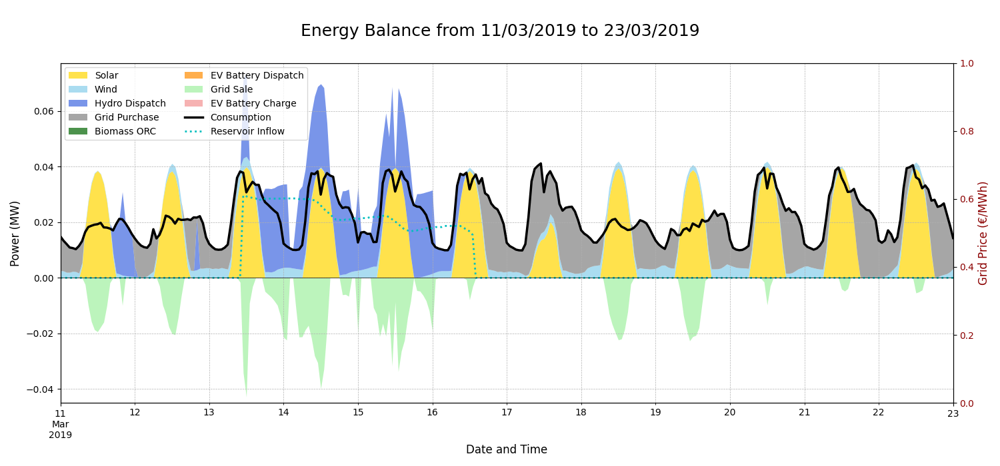
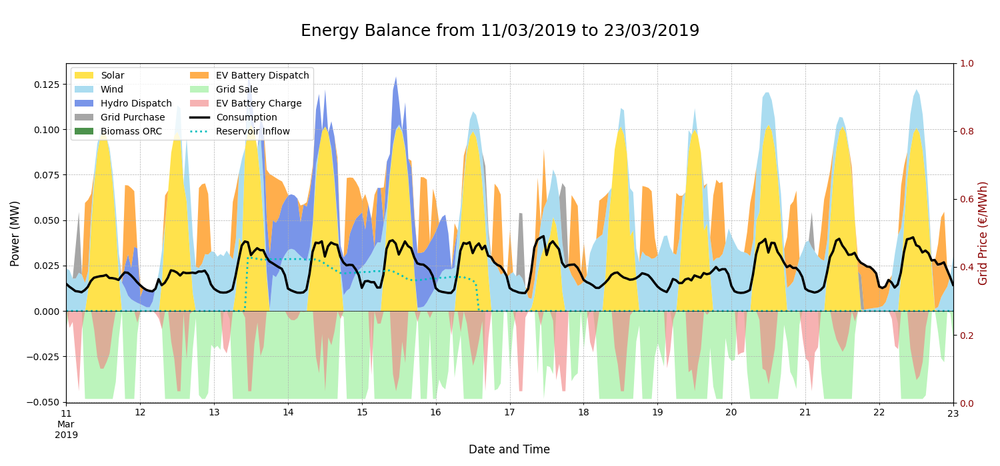
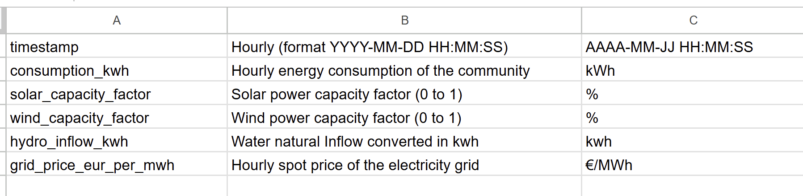
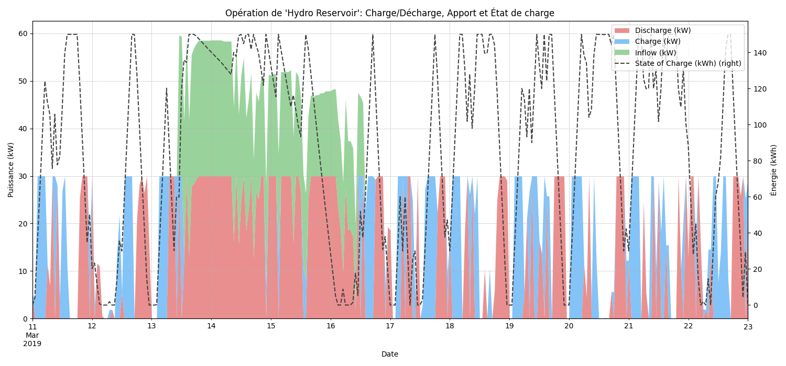

# Simplified PyPSA Energy System Optimization Model

Welcome! This repository provides a straightforward and accessible framework for designing and analyzing local hybrid energy systems. Built on the powerful **PyPSA (Python for Power System Analysis)** library, this model is intended as a simple entry point for students, researchers, and communities to size energy sources and understand how system design evolves with different constraints.

The goal is to lower the barrier to entry for energy system modeling, allowing you to get meaningful results without a steep learning curve.

----------

## Project Overview

### Example project overview
This project presents a comprehensive modeling and optimization of a hybrid renewable energy system for the community of **Castanheira de Pera, Portugal**. The primary objective is to determine the optimal mix of renewable energy sources—specifically **Solar PV** and **Wind Power**—to complement a pre-existing 30kW hydroelectric turbine. The model aims to meet the local energy demand while minimizing the total cost of the system, considering both capital expenditures (CAPEX) and operational costs (with an enphasing on already existing storage method).

The optimization is performed using the open-source Python library **[PyPSA](https://github.com/PyPSA/PyPSA)**. This tool allows for a detailed, time-series-based simulation of the energy system over a full year (2019) with an hourly resolution. The model also explores the potential of integrating a **Biomass Organic Rankine Cycle (ORC) plant** and leveraging **Vehicle-to-Grid (V2G)** technology from local electric vehicles as a form of battery storage.

This work was developed as part of an internship related to the European program [HY4RES](https://hy4res.eu/fr/).

----------

## Core Features

-   **Easy Configuration**: Most system assumptions, like costs and budgets, are centralized in a single, easy-to-edit parameter file (`utils/model_param.py`).
    
-   **Modular Design**: The model supports a mix of technologies, including solar, wind, biomass, hydro, grid connections, and storage.
    
-   **Storage & Flexibility**: Natively models advanced storage options like pumped-hydro and Vehicle-to-Grid (V2G) to analyze system flexibility.
    
-   **Economic Optimization**: The core objective is to find the technology mix that minimizes the total annualized cost of energy for the community.
    
-   **Built-in Visualization**: Automatically generates plots of the energy balance and storage operation to help you interpret the results.
    

----------

## Repository Structure

The project is organized to separate the core model from specific case studies. The main optimization scripts are located within a dedicated folder for each case study, making the repository clean and scalable.

```
.
│
├── optimiser main.py                # Main script to run the PyPSA optimization
├── utils/
│   ├── data_loader.py               # Module for loading and preparing data
│   ├── model_param.py               # Module containing all system parameters and costs
│   └── model_ploting.py             # Module for generating plots and visualizations
├── data/
│   ├── model_timeseries.csv      # Hourly time-series data for one year (consumption, wind/solar factors, grid price)
│
├── Case Study - Castanheira de Pera/
│   ├── optimiser_main.py
│   ├── Preprocessing/              # Scripts for automatic data preparation (renewable.ninja, portugese e-redes..)
│   	└── README.md                   # README to explain data preparation
│   ├── utils/
│   ├── data/
│   └── README.md                   # README specific to this case study
│
└── README.md                       # This general repository README

```

----------

## How It Works

The model takes your inputs, builds a virtual energy network, and finds the most economically viable way to meet the energy demand.

1.  **Inputs**: The model requires two main types of inputs:
    
    -   **Time-Series Data**: Hourly data for energy demand, renewable generation potential (capacity factors), and grid electricity prices.
        
    -   **Economic Parameters**: Technology costs (CAPEX, OPEX), lifetimes, and system-wide constraints like the total investment budget (`CAPEX_BUDGET`).
        
2.  **Network Model**: PyPSA constructs a representation of the local energy system, linking all production sources, storage units, and the consumer (load) to a central electrical bus.
    
    _A simplified view of the energy network graph:_
    
3.  **Optimization**: Using a linear solver, the model determines the optimal size (installed capacity) for each technology to minimize the total annual cost, which includes annualized investment costs, operational costs, and the net cost of grid electricity trading.
    
4.  **Outputs**: The result is a complete summary of the optimal system, including installed capacities, total investment, annual costs, and detailed operational plots showing how energy is produced, stored, and consumed at every hour of the year.
    
    _Example of an automatically generated energy balance plot:_

_low budget:_


_Optimal_budget:_


----------

## Getting Started

### 1. Prerequisites

Make sure you have Python 3.8+ and have installed the required packages. It's recommended to use a virtual environment.

Bash

```
# Clone the repository
git clone <repository-url>
cd <repository-folder>

# Install dependencies
pip install pypsa pandas numpy matplotlib

```

### 2. Prepare Your Data

Place your hourly time-series data in the `data/` folder within a specific case study directory. The model expects specific CSV files. For detailed instructions on data formatting and preparation, please see the guides in the `Preprocessing/` directory.

_The required input data structure for the model (replace with zeros if not needed):_


### 3. Configure the Model

Open `utils/model_param.py` inside your case study folder. This is where you set up your entire scenario without touching the core optimization code. Key parameters include:

-   `CAPEX_BUDGET`: The maximum investment allowed.
    
-   `ANNUAL_ENERGY_DEMAND`: The target demand to scale the consumption profile.
    
-   `CAPEX_...`, `OPEX_...`, `LIFE_...`: Cost and lifetime assumptions for each technology.
    

### 4. Run the Simulation

Execute the main script from within its case study directory (`Castanheira de Pera Example/`):

Bash

```
python optimiser_main.py

```

----------

## Example Use Cases

This model allows you to quickly answer critical "what-if" questions for a community energy project. And create a idea of what sources to install.

#### **What is the impact of my budget?**

By changing the `CAPEX_BUDGET`, you can see how the optimal system adapts. A small budget may only allow for a few solar panels, while a larger one enables a more diverse and resilient system with storage.

#### **What is the value of energy storage?**

You can enable or disable different storage technologies to quantify their economic and operational benefits. The model shows how storage allows the system to capture cheap renewable energy and use it during more expensive peak hours.

_generated plot for hydro storage opreration (with natural rain inflow):_

